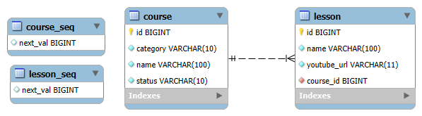

## 💻 Projeto

Esse projeto permite que seja criado um curso e a ele seja atribuído lições contendo um nome e o link para os vídeos do YouTube.

## ✅ Pré-requisitos

Antes de começar, você vai precisar ter instalado o [Docker](https://www.docker.com/) para a containerização dos componentes da aplicação.

## 📀 Como Rodar o Projeto

1.  Clone o repositório:
    ```bash
    git clone https://github.com/Matheus-AMoreira/CrudCourses.git
    ```

2.  Navegue até a pasta raiz do projeto:
    ```bash
    cd CrudCourses
    ```

3.  Execute o Docker Compose para construir as imagens e iniciar os containers:
    ```bash
    docker-compose up --build
    ```

A aplicação estará disponível nos seguintes endereços:
* **Frontend (Angular):** [http://localhost:4200](http://localhost:4200)
* **Backend (Spring Boot):** [http://localhost:8080](http://localhost:8080)
* **Banco de dados (MySQL):** [http://localhost:3306](http://localhost:3306)

**Nota sobre Configurações:** Por padrão, o backend aceita requisições apenas da origem `http://localhost:4200`. Se você precisar alterar a porta do frontend, lembre-se de atualizar a configuração de CORS no arquivo [WebConfig.java](backend/src/main/java/com/course/crudcourse/config/WebConfig.java) do backend.

## 🧾️ Modelo de Entidade Relacional

<p>
  
</p>

## 🚪 Endpoints da API

A URL base da API é `http://localhost:8080/api/courses`.

| Método | Endpoint          | Descrição                                 |
| :----- | :---------------- | :---------------------------------------- |
| `GET`  | `/`               | Retorna todos os cursos registrados.      |
| `GET`  | `/{id}`           | Retorna um curso específico pelo seu ID.  |
| `POST` | `/`               | Cria um novo curso.                       |
| `PUT`  | `/{id}`           | Atualiza os detalhes de um curso pelo ID. |
| `DELETE`| `/{id}`          | Deleta um curso pelo seu ID.              |


## 🔧 Tecnologias Utilizadas
- **Frontend:** [Angular](https://angular.dev/)
- **Backend:** [Spring Boot](https://spring.io/projects/spring-boot)
- **Banco de Dados:** [MySQL](https://www.mysql.com/)
- **Containerização:** [Docker](https://www.docker.com/)

#### Dependências Principais do Spring Boot
- [Hibernate](https://hibernate.org/orm/)
- [Spring Web](https://mvnrepository.com/artifact/org.springframework/spring-web)
- [MySQL Driver](https://mvnrepository.com/artifact/com.mysql/mysql-connector-j)
- [Spring Validation](https://mvnrepository.com/artifact/org.springframework.boot/spring-boot-starter-validation)
- [Spring Boot DevTools](https://mvnrepository.com/artifact/org.springframework.boot/spring-boot-devtools)
- [Lombok](https://mvnrepository.com/artifact/org.projectlombok/lombok)
